# CICS Banking Sample Application (CBSA) - Program Dependencies Architecture

## Architecture Overview

This document provides a comprehensive view of the program dependencies within the CBSA application, organized by functional layers.

## Architecture Diagram (Mermaid)

```mermaid
graph TB
    subgraph "User Interface Layer (BMS Maps)"
        BNKMENU[BNKMENU<br/>Main Menu]
        BNK1CAC[BNK1CAC<br/>Create Account UI]
        BNK1DAC[BNK1DAC<br/>Delete Account UI]
        BNK1UAC[BNK1UAC<br/>Update Account UI]
        BNK1TFN[BNK1TFN<br/>Transfer Funds UI]
        BNK1CCA[BNK1CCA<br/>Create Customer UI]
        BNK1CCS[BNK1CCS<br/>Customer Search UI]
        BNK1DCS[BNK1DCS<br/>Delete Customer UI]
        BNK1CRA[BNK1CRA<br/>Credit Agency UI]
        UPDTACCT[UPDTACCT<br/>Update Account]
    end
    
    subgraph "Business Logic - Account Operations"
        CREACC[CREACC<br/>Create Account]
        DELACC[DELACC<br/>Delete Account]
        UPDACC[UPDACC<br/>Update Account]
        INQACC[INQACC<br/>Inquire Account]
        INQACCCU[INQACCCU<br/>Inquire Account by Customer]
    end
    
    subgraph "Business Logic - Customer Operations"
        CRECUST[CRECUST<br/>Create Customer]
        DELCUS[DELCUS<br/>Delete Customer]
        UPDCUST[UPDCUST<br/>Update Customer]
        INQCUST[INQCUST<br/>Inquire Customer]
        INQCUSPH[INQCUSPH<br/>Inquire Customer Phone]
    end
    
    subgraph "Business Logic - Transaction Operations"
        XFRFUN[XFRFUN<br/>Transfer Funds]
        DBCRFUN[DBCRFUN<br/>Debit/Credit]
    end
    
    subgraph "Utility & Support Programs"
        ABNDPROC[ABNDPROC<br/>Abend Handler]
        GETCOMPY[GETCOMPY<br/>Get Company]
        GETSCODE[GETSCODE<br/>Get Sort Code]
        BANKDATA[BANKDATA<br/>Batch Data Load]
    end
    
    subgraph "External Services"
        CRDTAGY1[CRDTAGY1<br/>Credit Agency 1]
        CRDTAGY2[CRDTAGY2<br/>Credit Agency 2]
        CRDTAGY3[CRDTAGY3<br/>Credit Agency 3]
        CRDTAGY4[CRDTAGY4<br/>Credit Agency 4]
        CRDTAGY5[CRDTAGY5<br/>Credit Agency 5]
    end
    
    subgraph "Data Stores"
        DB2_ACCOUNT[(DB2 ACCOUNT<br/>Table)]
        VSAM_CUSTOMER[(VSAM CUSTOMER<br/>File)]
        DB2_PROCTRAN[(DB2 PROCTRAN<br/>Table)]
        DB2_CONTROL[(DB2 CONTROL<br/>Table)]
        VSAM_ABNDFILE[(VSAM ABNDFILE<br/>Abend Log)]
    end
    
    %% UI to Business Logic Dependencies
    BNK1CAC --> CREACC
    BNK1DAC --> DELACC
    BNK1UAC --> UPDACC
    BNK1TFN --> XFRFUN
    BNK1CCA --> CRECUST
    BNK1DCS --> DELCUS
    UPDTACCT -.LINK.-> INQACC
    UPDTACCT -.LINK.-> UPDACC
    UPDTACCT -.LINK.-> GETCOMPY
    
    %% Cross-Program Dependencies
    CREACC -.LINK.-> INQCUST
    CREACC -.LINK.-> INQACCCU
    DELCUS -.LINK.-> INQCUST
    DELCUS -.LINK.-> DELACC
    DELCUS -.LINK.-> INQACCCU
    INQACCCU -.LINK.-> INQCUST
    
    %% Credit Agency Dependencies (Async API)
    CRECUST -.Async API.-> CRDTAGY1
    CRECUST -.Async API.-> CRDTAGY2
    CRECUST -.Async API.-> CRDTAGY3
    CRECUST -.Async API.-> CRDTAGY4
    CRECUST -.Async API.-> CRDTAGY5
    
    %% Data Store Access
    CREACC --> DB2_ACCOUNT
    DELACC --> DB2_ACCOUNT
    UPDACC --> DB2_ACCOUNT
    INQACC --> DB2_ACCOUNT
    CREACC --> DB2_PROCTRAN
    CRECUST --> VSAM_CUSTOMER
    DELCUS --> VSAM_CUSTOMER
    UPDCUST --> VSAM_CUSTOMER
    INQCUST --> VSAM_CUSTOMER
    CRECUST --> DB2_PROCTRAN
    XFRFUN --> DB2_ACCOUNT
    XFRFUN --> DB2_PROCTRAN
    DBCRFUN --> DB2_ACCOUNT
    ABNDPROC --> VSAM_ABNDFILE
    
    %% Styling
    classDef uiLayer fill:#dae8fc,stroke:#6c8ebf,stroke-width:2px
    classDef businessLogic fill:#d5e8d4,stroke:#82b366,stroke-width:2px
    classDef utility fill:#fff2cc,stroke:#d6b656,stroke-width:2px
    classDef external fill:#f8cecc,stroke:#b85450,stroke-width:2px
    classDef datastore fill:#e1d5e7,stroke:#9673a6,stroke-width:2px
    
    class BNKMENU,BNK1CAC,BNK1DAC,BNK1UAC,BNK1TFN,BNK1CCA,BNK1CCS,BNK1DCS,BNK1CRA,UPDTACCT uiLayer
    class CREACC,DELACC,UPDACC,INQACC,INQACCCU,CRECUST,DELCUS,UPDCUST,INQCUST,INQCUSPH,XFRFUN,DBCRFUN businessLogic
    class ABNDPROC,GETCOMPY,GETSCODE,BANKDATA utility
    class CRDTAGY1,CRDTAGY2,CRDTAGY3,CRDTAGY4,CRDTAGY5 external
    class DB2_ACCOUNT,VSAM_CUSTOMER,DB2_PROCTRAN,DB2_CONTROL,VSAM_ABNDFILE datastore
```

## Program Categories

### 1. User Interface Layer (BMS Maps)
Programs that handle user interaction through 3270 terminal screens:

| Program | Purpose | Invokes |
|---------|---------|---------|
| **BNKMENU** | Main menu and transaction routing | Various business logic programs |
| **BNK1CAC** | Create Account UI | CREACC |
| **BNK1DAC** | Delete Account UI | DELACC |
| **BNK1UAC** | Update Account UI | UPDACC |
| **BNK1TFN** | Transfer Funds UI | XFRFUN |
| **BNK1CCA** | Create Customer UI | CRECUST |
| **BNK1CCS** | Customer Search UI | INQCUST |
| **BNK1DCS** | Delete Customer UI | DELCUS |
| **BNK1CRA** | Credit Agency UI | Credit agency programs |
| **UPDTACCT** | Update Account | INQACC, UPDACC, GETCOMPY |

### 2. Business Logic - Account Operations
Core account management programs:

| Program | Purpose | Dependencies | Data Access |
|---------|---------|--------------|-------------|
| **CREACC** | Create new account | INQCUST, INQACCCU | DB2 ACCOUNT, PROCTRAN |
| **DELACC** | Delete account | None | DB2 ACCOUNT |
| **UPDACC** | Update account details | None | DB2 ACCOUNT |
| **INQACC** | Inquire account information | None | DB2 ACCOUNT |
| **INQACCCU** | Inquire accounts by customer | INQCUST | DB2 ACCOUNT |

**Key Pattern**: CREACC uses Named Counter (ENQ/DEQ) for account number generation. If DB2 write fails, counter must be decremented before DEQUEUE.

### 3. Business Logic - Customer Operations
Core customer management programs:

| Program | Purpose | Dependencies | Data Access |
|---------|---------|--------------|-------------|
| **CRECUST** | Create new customer | CRDTAGY1-5 (Async API) | VSAM CUSTOMER, DB2 PROCTRAN |
| **DELCUS** | Delete customer | INQCUST, DELACC, INQACCCU | VSAM CUSTOMER |
| **UPDCUST** | Update customer details | None | VSAM CUSTOMER |
| **INQCUST** | Inquire customer information | None | VSAM CUSTOMER |
| **INQCUSPH** | Inquire customer by phone | None | VSAM CUSTOMER |

**Key Pattern**: CRECUST performs credit checks using Async API to multiple credit agencies (CRDTAGY1-5), waits 3 seconds, then aggregates scores.

### 4. Business Logic - Transaction Operations
Financial transaction processing:

| Program | Purpose | Dependencies | Data Access |
|---------|---------|--------------|-------------|
| **XFRFUN** | Transfer funds between accounts | None | DB2 ACCOUNT, PROCTRAN |
| **DBCRFUN** | Debit/Credit operations | None | DB2 ACCOUNT |

### 5. Utility & Support Programs
Common utility functions:

| Program | Purpose | Used By |
|---------|---------|---------|
| **ABNDPROC** | Abend handler | All programs (error handling) |
| **GETCOMPY** | Get company information | UPDTACCT |
| **GETSCODE** | Get sort code | Various programs |
| **BANKDATA** | Batch data load utility | Batch jobs |

**Critical**: All programs link to ABNDPROC for standardized error handling and logging to VSAM ABNDFILE.

### 6. External Services
Credit agency integration (Async API):

| Program | Purpose |
|---------|---------|
| **CRDTAGY1-5** | External credit score providers |

These are invoked asynchronously by CRECUST for credit scoring during customer creation.

## Data Stores

### DB2 Tables
- **ACCOUNT**: Account information (sortcode, account number, balance, etc.)
- **PROCTRAN**: Processed transactions log
- **CONTROL**: Internal control information and counters

### VSAM Files
- **CUSTOMER**: Customer information (name, address, DOB, credit score)
- **ABNDFILE**: Abend processing log

## Multi-Interface Architecture

The CBSA application supports three distinct user interfaces, all sharing the same COBOL backend:

1. **BMS 3270 Terminal**: Direct CICS program calls
2. **Carbon React UI**: Liberty JVM → JCICS API → COBOL programs
3. **Spring Boot UI**: z/OS Connect → CICS → COBOL programs

**Impact**: Changes to COBOL business logic programs affect all three interfaces.

## Key Architectural Patterns

### 1. Named Counter Pattern
Programs CREACC and CRECUST use ENQ/DEQ with Named Counters for generating sequential numbers:
- **CREACC**: Account number generation (CBSAACCT counter)
- **CRECUST**: Customer number generation (CBSACUST counter)

**Critical Rule**: If database write fails, counter MUST be decremented before DEQUEUE to restore state.

### 2. Error Handling Pattern
All programs follow standardized error handling:
1. Detect error condition
2. Populate ABNDINFO-REC with error details
3. LINK to ABNDPROC
4. ABNDPROC logs to VSAM ABNDFILE
5. Return control or abend task

### 3. Cross-Program Communication
Programs communicate via:
- **EXEC CICS LINK**: Synchronous program calls with COMMAREA
- **Async API**: Asynchronous calls to credit agencies (CRECUST only)
- **Shared Data Stores**: DB2 tables and VSAM files

### 4. Transaction Processing Pattern
Financial transactions follow:
1. Validate inputs
2. ENQ resources if needed
3. Read current state
4. Perform calculations
5. Update data stores
6. Write to PROCTRAN log
7. DEQ resources
8. Return results

## Dependency Summary

### Most Connected Programs
1. **ABNDPROC**: Linked by all programs for error handling
2. **INQCUST**: Called by CREACC, DELCUS, INQACCCU for customer validation
3. **INQACC**: Called by UPDTACCT for account validation
4. **DB2 ACCOUNT**: Accessed by all account operation programs

### Critical Dependencies
- **DELCUS → DELACC**: Must delete all accounts before deleting customer
- **DELCUS → INQACCCU**: Checks for existing accounts before deletion
- **CREACC → INQCUST**: Validates customer exists before creating account
- **CRECUST → CRDTAGY1-5**: Credit scoring via async API

## Copybook Dependencies

All programs use shared copybooks from `src/base/cobol_copy/`:
- **ACCOUNT.cpy**: Account data structure
- **CUSTOMER.cpy**: Customer data structure
- **PROCTRAN.cpy**: Transaction log structure
- **ABNDINFO.cpy**: Abend information structure
- **Various DB2 copybooks**: ACCDB2, PROCDB2, CONTDB2

**Rule**: Always use COPY statements rather than duplicating structures.

## Notes for Architects

1. **Scalability**: Named Counter pattern may become bottleneck under high load
2. **Availability**: VSAM CUSTOMER file is single point of failure for customer operations
3. **Performance**: Async credit agency calls add 3-second delay to customer creation
4. **Maintainability**: Multi-interface architecture requires coordinated testing across all UIs
5. **Security**: Credit agency integration requires secure API credentials management

## Related Documentation

- [CBSA Architecture Guide](CBSA_Architecture_guide.md)
- [BMS User Guide](../etc/usage/base/doc/CBSA_BMS_User_Guide.md)
- [Base Installation Guide](../etc/install/base/doc/README.md)
- [AGENTS.md](../AGENTS.md) - Development guidelines and patterns