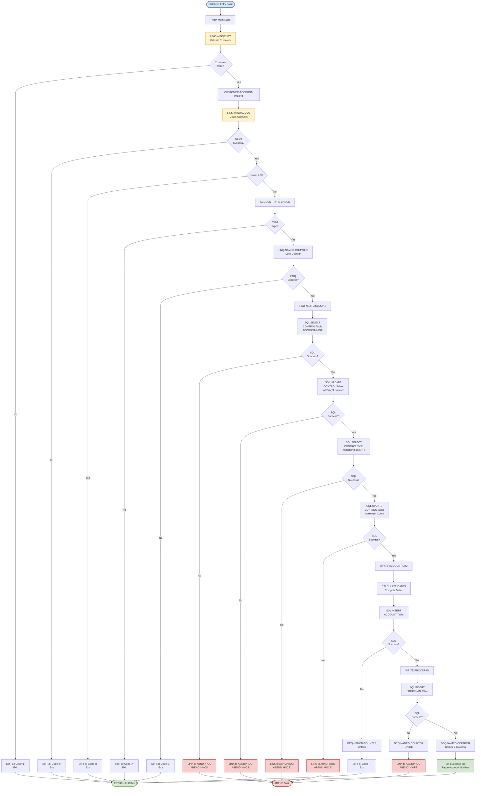

# CREACC Program Call Graph

## Program Overview

**Program ID**: CREACC  
**Purpose**: Create Account - Takes account information and creates a new account record in DB2  
**Author**: Jon Collett  
**File**: [`src/base/cobol_src/CREACC.cbl`](../src/base/cobol_src/CREACC.cbl)

## Program Description

This program creates a new bank account by:
1. Validating the customer exists
2. Checking account count limits (max 9 accounts per customer)
3. Validating account type
4. Using Named Counter pattern to generate unique account number
5. Writing to DB2 ACCOUNT table
6. Writing transaction log to DB2 PROCTRAN table
7. Properly handling errors and counter rollback

## Call Graph Diagram



## Detailed Call Sequence

### 1. Entry Point (P010)
**Lines**: 286-379

**Actions**:
- Initialize variables
- Move sortcode to required fields
- Begin validation sequence

### 2. Customer Validation
**Section**: P010 (lines 304-322)  
**Program Called**: [`INQCUST`](../src/base/cobol_src/INQCUST.cbl)  
**Call Type**: EXEC CICS LINK  
**Purpose**: Validate that the customer exists

**Flow**:
```
MOVE COMM-CUSTNO TO INQCUST-CUSTNO
EXEC CICS LINK PROGRAM('INQCUST')
  COMMAREA(INQCUST-COMMAREA)
  RESP(WS-CICS-RESP)
END-EXEC

IF EIBRESP NOT = DFHRESP(NORMAL)
OR INQCUST-INQ-SUCCESS NOT = 'Y'
  → Set COMM-FAIL-CODE = '1'
  → Exit
END-IF
```

### 3. Account Count Check
**Section**: CUSTOMER-ACCOUNT-COUNT (lines 1080-1095)  
**Program Called**: [`INQACCCU`](../src/base/cobol_src/INQACCCU.cbl)  
**Call Type**: EXEC CICS LINK  
**Purpose**: Count existing accounts for customer (max 9 allowed)

**Flow**:
```
MOVE 20 TO NUMBER-OF-ACCOUNTS
MOVE COMM-CUSTNO TO CUSTOMER-NUMBER
EXEC CICS LINK PROGRAM('INQACCCU')
  COMMAREA(INQACCCU-COMMAREA)
  RESP(WS-CICS-RESP)
  SYNCONRETURN
END-EXEC

IF WS-CICS-RESP NOT = DFHRESP(NORMAL)
  → Set COMM-FAIL-CODE = '9'
  → Exit
END-IF

IF NUMBER-OF-ACCOUNTS > 9
  → Set COMM-FAIL-CODE = '8'
  → Exit
END-IF
```

### 4. Account Type Validation
**Section**: ACCOUNT-TYPE-CHECK (lines 1209-1228)  
**Purpose**: Validate account type is one of: ISA, MORTGAGE, SAVING, CURRENT, LOAN

**Flow**:
```
EVALUATE TRUE
  WHEN COMM-ACC-TYPE = 'ISA'
  WHEN COMM-ACC-TYPE = 'MORTGAGE'
  WHEN COMM-ACC-TYPE = 'SAVING'
  WHEN COMM-ACC-TYPE = 'CURRENT'
  WHEN COMM-ACC-TYPE = 'LOAN'
    → Continue
  WHEN OTHER
    → Set COMM-FAIL-CODE = 'A'
    → Exit
END-EVALUATE
```

### 5. Named Counter Enqueue
**Section**: ENQ-NAMED-COUNTER (lines 385-404)  
**Purpose**: Lock the account number counter to prevent concurrent access

**Flow**:
```
MOVE SORTCODE TO NCS-ACC-NO-TEST-SORT
EXEC CICS ENQ
  RESOURCE(NCS-ACC-NO-NAME)  ← 'CBSAACCT' + sortcode
  LENGTH(16)
  RESP(WS-CICS-RESP)
END-EXEC

IF WS-CICS-RESP NOT = DFHRESP(NORMAL)
  → Set COMM-FAIL-CODE = '3'
  → Exit
END-IF
```

### 6. Find Next Account Number
**Section**: FIND-NEXT-ACCOUNT (lines 429-768)  
**Database**: DB2 CONTROL table  
**Purpose**: Get and increment account number counter

**Flow**:
```
Step 1: Read current ACCOUNT-LAST counter
  EXEC SQL
    SELECT CONTROL_VALUE_NUM
    INTO :HV-CONTROL-VALUE-NUM
    FROM CONTROL
    WHERE CONTROL_NAME = '<sortcode>-ACCOUNT-LAST'
  END-EXEC
  
  IF SQLCODE NOT = 0
    → LINK to ABNDPROC
    → ABEND 'HNCS'
  END-IF

Step 2: Increment and update counter
  ADD 1 TO HV-CONTROL-VALUE-NUM
  EXEC SQL
    UPDATE CONTROL
    SET CONTROL_VALUE_NUM = :HV-CONTROL-VALUE-NUM
    WHERE CONTROL_NAME = '<sortcode>-ACCOUNT-LAST'
  END-EXEC
  
  IF SQLCODE NOT = 0
    → LINK to ABNDPROC
    → ABEND 'HNCS'
  END-IF

Step 3: Read and increment ACCOUNT-COUNT
  EXEC SQL
    SELECT CONTROL_VALUE_NUM
    INTO :HV-CONTROL-VALUE-NUM
    FROM CONTROL
    WHERE CONTROL_NAME = '<sortcode>-ACCOUNT-COUNT'
  END-EXEC
  
  IF SQLCODE NOT = 0
    → LINK to ABNDPROC
    → ABEND 'HNCS'
  END-IF
  
  ADD 1 TO HV-CONTROL-VALUE-NUM
  EXEC SQL
    UPDATE CONTROL
    SET CONTROL_VALUE_NUM = :HV-CONTROL-VALUE-NUM
    WHERE CONTROL_NAME = '<sortcode>-ACCOUNT-COUNT'
  END-EXEC
  
  IF SQLCODE NOT = 0
    → LINK to ABNDPROC
    → ABEND 'HNCS'
  END-IF
```

### 7. Write Account to DB2
**Section**: WRITE-ACCOUNT-DB2 (lines 774-920)  
**Database**: DB2 ACCOUNT table  
**Purpose**: Insert new account record

**Flow**:
```
Step 1: Calculate dates
  PERFORM CALCULATE-DATES
    → Sets ACCOUNT-OPENED = today
    → Sets ACCOUNT-LAST-STMT = today
    → Sets ACCOUNT-NEXT-STMT = today + 30 days

Step 2: Insert account record
  EXEC SQL
    INSERT INTO ACCOUNT (
      ACCOUNT_EYECATCHER,
      ACCOUNT_CUSTOMER_NUMBER,
      ACCOUNT_SORTCODE,
      ACCOUNT_NUMBER,
      ACCOUNT_TYPE,
      ACCOUNT_INTEREST_RATE,
      ACCOUNT_OPENED,
      ACCOUNT_OVERDRAFT_LIMIT,
      ACCOUNT_LAST_STATEMENT,
      ACCOUNT_NEXT_STATEMENT,
      ACCOUNT_AVAILABLE_BALANCE,
      ACCOUNT_ACTUAL_BALANCE
    ) VALUES (...)
  END-EXEC
  
  IF SQLCODE NOT = 0
    → PERFORM DEQ-NAMED-COUNTER  ← CRITICAL: Unlock counter
    → Set COMM-FAIL-CODE = '7'
    → Exit
  END-IF
```

### 8. Write Transaction Log
**Section**: WRITE-PROCTRAN (lines 922-1065)  
**Database**: DB2 PROCTRAN table  
**Purpose**: Log the account creation transaction

**Flow**:
```
EXEC SQL
  INSERT INTO PROCTRAN (
    PROCTRAN_EYECATCHER,
    PROCTRAN_SORT_CODE,
    PROCTRAN_ACC_NUMBER,
    PROCTRAN_DATE,
    PROCTRAN_TIME,
    PROCTRAN_REF,
    PROCTRAN_TYPE,
    PROCTRAN_DESC,
    PROCTRAN_AMOUNT
  ) VALUES (...)
END-EXEC

IF SQLCODE NOT = 0
  → PERFORM DEQ-NAMED-COUNTER  ← CRITICAL: Unlock counter
  → LINK to ABNDPROC
  → ABEND 'HWPT'
END-IF
```

### 9. Named Counter Dequeue
**Section**: DEQ-NAMED-COUNTER (lines 407-426)  
**Purpose**: Unlock the account number counter

**Flow**:
```
EXEC CICS DEQ
  RESOURCE(NCS-ACC-NO-NAME)
  LENGTH(16)
  RESP(WS-CICS-RESP)
END-EXEC

IF WS-CICS-RESP NOT = DFHRESP(NORMAL)
  → Set COMM-FAIL-CODE = '5'
  → Exit
END-IF
```

### 10. Error Handling (Multiple Locations)
**Program Called**: [`ABNDPROC`](../src/base/cobol_src/ABNDPROC.cbl)  
**Call Type**: EXEC CICS LINK  
**Purpose**: Standardized error logging and abend handling

**Called From**:
- Line 508: FIND-NEXT-ACCOUNT - DB2 SELECT failure
- Line 586: FIND-NEXT-ACCOUNT - DB2 UPDATE failure (counter)
- Line 674: FIND-NEXT-ACCOUNT - DB2 SELECT failure (count)
- Line 751: FIND-NEXT-ACCOUNT - DB2 UPDATE failure (count)
- Line 1055: WRITE-PROCTRAN - DB2 INSERT failure

**Flow**:
```
INITIALIZE ABNDINFO-REC
MOVE EIBRESP TO ABND-RESPCODE
MOVE EIBRESP2 TO ABND-RESP2CODE
EXEC CICS ASSIGN APPLID(ABND-APPLID)
END-EXEC
MOVE EIBTASKN TO ABND-TASKNO-KEY
MOVE EIBTRNID TO ABND-TRANID
PERFORM POPULATE-TIME-DATE2
MOVE WS-ORIG-DATE TO ABND-DATE
MOVE WS-TIME-NOW TO ABND-TIME
MOVE SQLCODE TO ABND-SQLCODE
STRING error-message INTO ABND-FREEFORM
END-STRING

EXEC CICS LINK PROGRAM(WS-ABEND-PGM)  ← 'ABNDPROC'
  COMMAREA(ABNDINFO-REC)
END-EXEC

EXEC CICS ABEND
  ABCODE('HNCS' or 'HWPT')
  NODUMP
END-EXEC
```

## Program Dependencies Summary

### Programs Called (LINK)
1. **INQCUST** - Customer inquiry/validation
2. **INQACCCU** - Account count by customer
3. **ABNDPROC** - Error handling (called 5 times on different error paths)

### Database Tables Accessed

#### DB2 CONTROL Table
- **SELECT** (2 times):
  - `<sortcode>-ACCOUNT-LAST`: Get last account number
  - `<sortcode>-ACCOUNT-COUNT`: Get account count
- **UPDATE** (2 times):
  - Increment ACCOUNT-LAST counter
  - Increment ACCOUNT-COUNT counter

#### DB2 ACCOUNT Table
- **INSERT** (1 time): Create new account record

#### DB2 PROCTRAN Table
- **INSERT** (1 time): Log account creation transaction

### Copybooks Used
- **SORTCODE** - Sort code definitions
- **ACCDB2** - DB2 ACCOUNT table structure
- **PROCDB2** - DB2 PROCTRAN table structure
- **PROCTRAN** - Transaction structure
- **ACCOUNT** - Account data structure
- **CUSTOMER** - Customer data structure
- **ACCTCTRL** - Account control structure
- **ABNDINFO** - Abend information structure
- **INQCUST** - INQCUST COMMAREA structure
- **INQACCCU** - INQACCCU COMMAREA structure
- **CREACC** - CREACC COMMAREA structure (DFHCOMMAREA)

## Critical Architectural Pattern: Named Counter

### Pattern Description
CREACC uses the **Named Counter Pattern** with ENQ/DEQ for generating sequential account numbers:

1. **ENQ** (Enqueue) - Lock the counter resource
2. **Read** current counter value from DB2 CONTROL table
3. **Increment** counter value
4. **Update** counter in DB2 CONTROL table
5. **Use** the new value for account number
6. **Write** to ACCOUNT and PROCTRAN tables
7. **DEQ** (Dequeue) - Unlock the counter resource

### Critical Rule
**If any database write fails after incrementing the counter, the counter MUST be decremented before DEQUEUE to restore state.**

However, in CREACC's current implementation:
- On ACCOUNT INSERT failure (line 863): DEQ is called but counter is NOT decremented
- On PROCTRAN INSERT failure (line 1006): DEQ is called but counter is NOT decremented

This means failed account creations will create gaps in account numbers, which is acceptable for this application.

### Counter Resource Name
```cobol
NCS-ACC-NO-NAME = 'CBSAACCT' + sortcode + '  '
```
Example: `CBSAACCT123456  ` (16 bytes total)

## Error Codes

| Code | Meaning | Location |
|------|---------|----------|
| '1' | Customer validation failed | Line 318 |
| '3' | ENQ (lock) failed | Line 399 |
| '5' | DEQ (unlock) failed | Line 421 |
| '7' | ACCOUNT INSERT failed | Line 862 |
| '8' | Customer has too many accounts (>9) | Line 349 |
| '9' | Account count check failed | Lines 333, 341 |
| 'A' | Invalid account type | Line 1224 |

## ABEND Codes

| Code | Meaning | Location |
|------|---------|----------|
| 'HNCS' | Named Counter System error (DB2 CONTROL table access failed) | Lines 518, 597, 685, 762 |
| 'HWPT' | Write PROCTRAN error (DB2 PROCTRAN INSERT failed) | Line 1060 |

## Performance Considerations

1. **ENQ Duration**: Counter is locked for the entire account creation process, including DB2 writes
2. **Sequential Bottleneck**: Only one account can be created at a time per sortcode
3. **DB2 Operations**: 6 SQL operations per account creation (2 SELECTs, 2 UPDATEs, 2 INSERTs)
4. **Synchronous Calls**: All LINK calls are synchronous, blocking execution

## Testing Considerations

### Happy Path Test
1. Valid customer number
2. Customer has < 9 accounts
3. Valid account type (ISA, MORTGAGE, SAVING, CURRENT, LOAN)
4. All DB2 operations succeed
5. Expected: New account created, counter incremented, success returned

### Error Path Tests
1. **Invalid Customer**: INQCUST returns failure
2. **Too Many Accounts**: Customer already has 9 accounts
3. **Invalid Account Type**: Account type not in allowed list
4. **ENQ Failure**: Counter resource already locked
5. **DB2 Failures**: Test each SQL operation failure
6. **DEQ Failure**: Unlock operation fails

### Concurrency Tests
1. Multiple simultaneous account creations for same sortcode
2. Verify ENQ prevents race conditions
3. Verify counter increments correctly under load

## Related Documentation

- [CBSA Program Dependencies](CBSA_Program_Dependencies.md) - Overall application architecture
- [INQCUST Program](../src/base/cobol_src/INQCUST.cbl) - Customer inquiry
- [INQACCCU Program](../src/base/cobol_src/INQACCCU.cbl) - Account count inquiry
- [ABNDPROC Program](../src/base/cobol_src/ABNDPROC.cbl) - Error handler
- [AGENTS.md](../AGENTS.md) - Named Counter pattern documentation